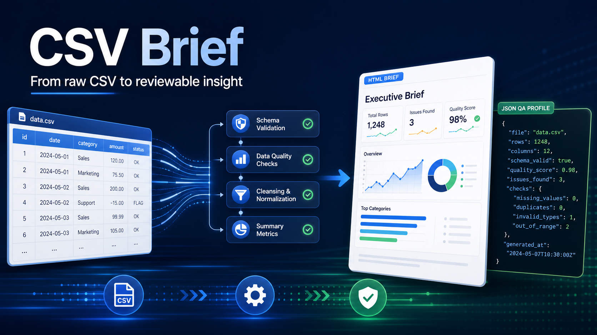

# CSV Brief



[](https://github.com/TonyInsightOps/csv-brief/actions/workflows/test.yml)


[](LICENSE)

> **Local-only and stdlib-only:** CSV Brief makes no network requests, emits no
> telemetry, requires no credentials, and uses only the Python standard library.
> Python 3.9 or newer is required.

CSV Brief turns a CSV file into two reviewable local artifacts:

- a self-contained HTML data brief for a client or reviewer;
- a JSON profile for reproducible QA and downstream work.

It is a small portfolio product for CSV cleaning, BI, and public-data research
jobs. It reports structure, missing cells, exact duplicate rows, inferred basic
column types, numeric/date ranges, and optional top text values.

Its standout feature, **JoinGuard**, audits a user-declared single or composite
key before a Power BI, SQL, or spreadsheet join. It reports blank-key rows,
duplicate key groups, exact source-row evidence, and whether the declared key
passes baseline structural checks for the one-side of a one-to-one join. It
never guesses which key is correct or proves that the chosen relationship is
semantically valid.

The second advanced feature, **Schema / Quality Drift Guard**, compares a
baseline CSV with the current export. It records added and removed columns,
basic type changes, row-count movement, per-column missing-rate and distinct-
count changes, and declared-key uniqueness regression in deterministic JSON.

## Hard boundaries

CSV Brief does **not** parse XLSX workbooks or PDFs, fetch webpages, run OCR,
perform fuzzy matching, infer missing values, detect fraud, prove source truth,
or replace analyst review. Type inference is a deterministic convenience, not a
business definition. Review the generated report before sharing it.

## One-command demo

Open a terminal in the directory containing this README and run:

```bash
python3 scripts/run_demo.py
```

The demo compares two bundled synthetic fixtures, writes into a temporary local
directory, and prints a clear `[PASS]` or `[FAIL]` result. A pass means the demo
correctly detected its intentionally planted quality regressions.

## Run on a CSV

```bash
python3 src/csv_brief.py assets/synthetic_sales.csv \
  --baseline assets/synthetic_sales_baseline.csv \
  --output-dir my-brief \
  --title "Synthetic Sales Data Brief" \
  --key order_id
```

Outputs:

- `my-brief/brief.html`
- `my-brief/profile.json`
- `my-brief/drift.json` when `--baseline` is supplied

Drift Guard is fail-closed for review-level regressions. It writes all outputs
first, then exits with status `2` when it detects a new/removed column, type
change, missing-rate increase, or a declared key that is not one-to-one ready.
Row-count changes, distinct-count changes, missing-rate decreases, and key
improvements are still recorded but are informational and do not fail the gate.
Malformed or unreadable baseline/current files raise an error rather than
producing a passing comparison.

For a safer report that does not include the most common text values:

```bash
python3 src/csv_brief.py assets/synthetic_sales.csv \
  --output-dir my-brief-private \
  --hide-top-values
```

Repeat `--key` for a composite key. Use `--hide-key-values` to retain duplicate
source-row evidence without printing the actual key values:

```bash
python3 src/csv_brief.py dimension.csv \
  --output-dir dimension-brief \
  --key account_id --key region \
  --hide-key-values
```

## Current test scope

```bash
python3 -m unittest discover -s tests -v
```

The twelve tests cover the bundled synthetic profile, numeric/date inference,
HTML and JSON generation, suppression of top text values, rejection of ragged
rows and blank headers, duplicate declared keys with exact source-row lineage,
composite keys, blank key parts, hidden key values, and unknown key rejection.
They also cover unchanged baselines, row/missing/distinct drift, key uniqueness
regression, added/removed columns, type changes, persisted drift JSON/HTML, and
fail-closed CLI behavior for review-level drift and malformed baselines. They do
not cover real customer files, XLSX, OCR, large-file performance,
locale-specific number/date formats, fuzzy duplicates, semantic schema
compatibility, or business-specific thresholds.

## Easy-to-scope client deliverable

A fixed-scope engagement can be defined as: up to three CSV exports, one
declared single/composite key per file, local deterministic profiling, JoinGuard
evidence, one agreed baseline comparison, HTML briefs, JSON profiles/drift
registers, and an analyst-reviewed findings note.
Entity resolution, fuzzy matching, source-system fixes, and dashboard changes
remain separately quoted work.

## Privacy and safe use

The tool does not upload data, but its HTML report may contain column names and
top text values from the input. Use `--hide-top-values`, inspect outputs, and
never publish customer, personal, confidential, or proprietary data without
authorization. The bundled fixture is invented and safe for demonstrations.

## Commercial use

The MIT license permits commercial use. The open prototype can support paid
work such as custom profiling rules, private workbook conversion, dashboard
design, data cleanup, and analyst-reviewed public-data briefs.

## Client-ready service

### CSV Data Quality Mini Audit — US$99 fixed

- up to 5,000 CSV rows;
- one agreed deterministic duplicate key;
- reproducible JSON profile, optional baseline drift register, and a reviewable HTML brief;
- JoinGuard source-row evidence for blank or duplicate declared keys;
- concise QA and reconciliation notes;
- delivery through an active, funded marketplace contract.

Data cleaning, corrected output files, larger files, fuzzy entity matching,
XLSX workbooks, dashboards, and custom business rules are scoped separately
before work begins.

**[Hire me on Upwork](https://www.upwork.com/freelancers/~0126ecd9d346d44de2)**

For privacy, never post client files or personal data in GitHub issues.
